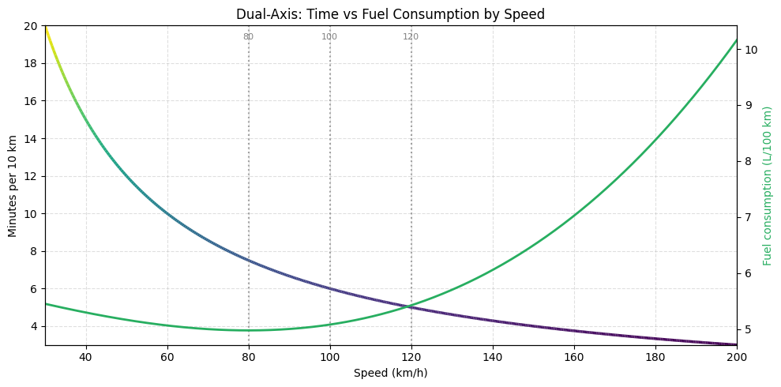

# Speed Efficiency Explorer  
An interactive model that visualizes how vehicle speed affects:
- **travel time per 100 km**
- **fuel consumption**
- **diminishing returns of speed**
- **remaining potential to gain time**
- **optimal driving zones**

The goal is to provide a simple, intuitive tool for understanding why *going faster doesn’t always save as much time as people expect*, and why fuel and risk both rise disproportionately at high speeds.

---

## 🚀 Live Demo (GitHub Pages)
Once GitHub Pages is enabled, the demo will be available here: https://kai-probably.github.io/speed-kills/

> The linked page will automatically render the interactive HTML prototype included in this repository.

The project currently runs entirely within the browser – no backend, no build tools, no dependencies.

---

## 🧠 Concept Overview

### Travel Time
Travel time per 100 km follows a simple formula:
time = 6000 / speed
This makes it very clear how diminishing returns work:
- increasing from 60 → 80 km/h saves **15 minutes**
- increasing from 120 → 140 km/h saves **~2 minutes**
- increasing from 160 → 200 km/h saves **less than 1 minute**

The faster you already are, the less time you can save by going even faster.

### Remaining Speed Benefit (Potential)

To visualize diminishing returns more intuitively, we normalize “improvement potential” between two anchor speeds:
30 km/h = 100% potential left
200 km/h = 0% potential left
This shows *how much benefit is still available* by going faster.  
The bar shrinks and changes color as speed increases.

### Fuel Consumption (Simplified Model)

A lightweight cubic model approximates the typical fuel efficiency curve:
- best around 70–90 km/h
- worsens above 100 km/h
- rises steeply past 130 km/h

This is not tied to a specific car but reflects general aerodynamic and engine-load behaviors.

### Driving Zones

The speed bar is divided into clear, color-coded zones:

| Speed Range | Zone Description |
|-------------|------------------|
| 50–80 km/h  | Win–win: fast & efficient |
| 80–100 km/h | Fuel-efficiency sweet spot |
| 100–120 km/h | Time-efficiency plateau |
| 120–140 km/h | Risk rising |
| 140–200 km/h | Crash severity increases super-linearly |

The goal is intuitive communication, not preaching.

---

## 🛠 Planned Features

The long-term vision: an app

### Phase 1 — Web Demo Improvements
- Add “trip distance” slider
- Add “compare speed jumps” panel (e.g., 100 → 130 saves X minutes)
- Add portrait/mobile layout
- Add social-media-friendly export (image snapshot)

### Phase 2 — Data + Realism
- Integrate live fuel consumption curves from specific car profiles  
- Add CO₂ emissions logic  
- Add speed-limit overlays (country-specific)

### Phase 3 — App Prototype
- iOS/SwiftUI interface
- Live graph scaling
- Multi-factor recommendation (“best speed balancing time + fuel”)
- Optional risk curve subplot

---

## 🧪 Development Notes

- No external libraries used.
- All calculations are done directly in browser JavaScript.
- Designed to be self-contained and easy to port into a real frontend app.

## 💬 Contributing

This is a public, open prototype.  
Ideas, bug reports, and feature suggestions are welcome via Issues or Pull Requests.

## 📄 License

This project is licensed under the MIT License – see the LICENSE file for details.

## 👤 Author

Concept & product direction: **Kai**  
Technical implementation: assisted by ChatGPT
